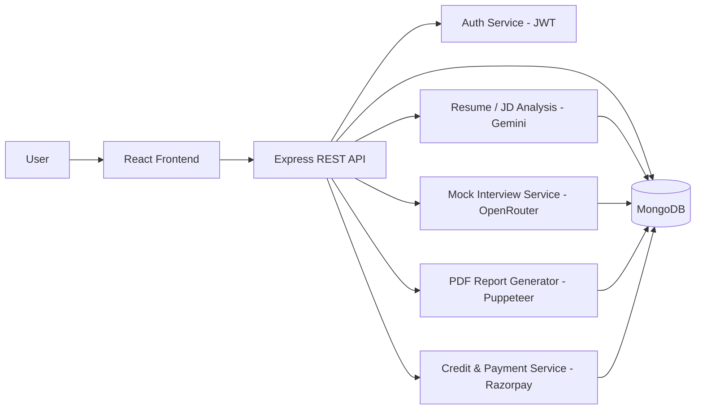

  

  
  
  

  <a href="#-features">Features</a> •
  <a href="#-tech-stack">Tech Stack</a> •
  <a href="#-architecture">Architecture</a> •
  <a href="#-screenshots">Screenshots</a> •
  <a href="#-roadmap">Roadmap</a>

---

## 📖 About

**UpSkale AI** is an AI-powered career preparation platform. Users upload their
resume, a job description, and a short self-description — the platform uses
**Google Gemini** to analyze all three and generate a tailored interview-prep
report. A separate AI mock interview system, powered by **OpenRouter**, runs
realistic timed practice interviews and scores performance in detail.

---

## ✨ Features

| | |
|---|---|
| 🧠 **AI Resume & JD Analysis** | Gemini analyzes your resume, job description, and profile together |
| 🎯 **Resume-to-JD Match Score** | Instantly see how well your resume aligns with the target role |
| 📊 **Skill Gap Analysis** | Identifies exactly what skills are missing for the role |
| 🗺️ **Preparation Roadmap** | Step-by-step personalized plan to close those gaps |
| 📄 **ATS-Friendly Resume** | Auto-generates a resume formatted to pass automated screening |
| 🎤 **AI Mock Interviews** | Timed questions across 3 difficulty levels, powered by OpenRouter |
| 📈 **Performance Dashboard** | Scores communication, correctness, and confidence per session |
| 💬 **Per-Question Feedback** | Strengths, improvement areas, and example answers for each question |
| 🧾 **Downloadable PDF Reports** | Generated with Puppeteer for offline review |
| 🕓 **Interview History** | All past sessions and reports saved and viewable anytime |
| 💳 **Credit-Based Usage** | Free starter credits, with Razorpay integration to purchase more |

---

## 🛠️ Tech Stack

  

| Layer | Tools |
|---|---|
| **Frontend** | React.js |
| **Backend** | Node.js, Express.js, REST APIs |
| **Database** | MongoDB |
| **AI / GenAI** | Google Gemini, OpenRouter |
| **Auth** | JWT |
| **Payments** | Razorpay |
| **Reports** | Puppeteer (PDF generation) |
| **Deployment** | Vercel (frontend), Render (backend) |

---

## 🧩 Architecture

*(This diagram renders natively on GitHub — no extra image needed.)*

---

## 🖼️ Screenshots

  
  
  
  

---

## 🗺️ Roadmap

- [x] AI resume + JD analysis with Gemini
- [x] AI mock interview system with OpenRouter
- [x] Credit-based usage with Razorpay
- [x] PDF report generation + interview history
- [ ] Improve mock interview answer accuracy
- [ ] Add more interview role templates
- [ ] Add testing & observability

---

## 📫 Contact

  
  

